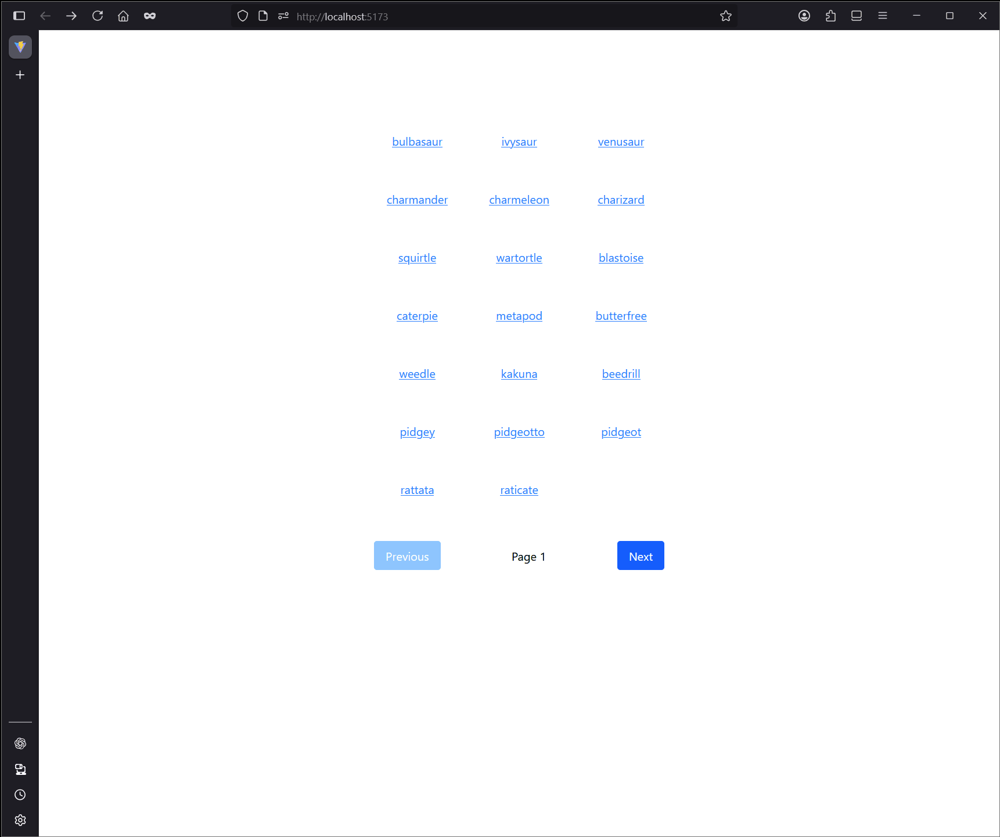

# 🧪 Mini Pokedex – Paired Exercise

A mini Pokedex application built using React, React Router, React Query, Axios, and Tailwind CSS. This project demonstrates client-side routing, data fetching with caching, pagination, and basic styling with Tailwind.



## 🚀 Features

- Browse Pokémon with pagination (20 per page)

- View detailed info about each Pokémon

- Client-side routing using React Router

- Efficient data fetching and caching via React Query

- Responsive UI styled with Tailwind CSS

## 🛠️ Tech Stack

- Vite + React

- React Router

- React Query (@tanstack)

- Axios

- Tailwind CSS

## 📦 Setup Instructions

1. Create the Project:

   ```bash
   npm create vite@latest mini-pokedex -- --template react
   cd mini-pokedex
   ```

2. Install Dependencies:

   ```bash
   npm install react-router-dom @tanstack/react-query axios
   ```

3. Start Dev Server:

   ```bash
   npm run dev
   ```

4. Configure Routing & Data Providers in `main.jsx` using:

   - `<QueryClientProvider>` from React Query

   - `<BrowserRouter>` for navigation

5. Home Page:

   - Uses `useQuery` to fetch paginated Pokémon data from the PokéAPI

   - Displays names as links to detail pages

   - Includes pagination controls

6. Detail Page:

   - Fetches and displays name, image, height, and weight of selected Pokémon

7. Styling Challenge:

   - Tailwind CSS was installed and used to style both the Home and Detail pages based on reference screenshots

## 🔗 Usage

- Navigate to / to view the Pokémon list

- Use pagination buttons to browse

- Click a name to go to /pokemon/:pokemonName for detailed info

### 🧑‍🤝‍🧑Participants

[@BrandonGonz](https://github.com/BrandonGonz)

[@blopez024](https://github.com/blopez024)
